# Submission by Cookie Clan for T-Hacks v3.0
Entry of Cookie Clan, from SRM Institute of Science and Technology, Kattankulathur, to T-Hacks v3.0.

<h2 align= "left"><b>Tracks and Problem Statement</b></h2>

Open Innovation: An open-ended theme where the only restriction is your imagination. Build the ideas that you believe in and make a difference. It can either be hardware or software.

Our Approach : We decided to come up with a Solution which makes the lives of children easier in the track of Education

<h2 align= "left"><b>Our Product</b></h2>

We cookie clan present before you,<b>"DigiLearn"</b> -Embark on a voyage of learning. Due to this pandemic our lives and education was at a pause and to overcome and resume education sector online classes played a major role. Students studying in higher class were able to manage all the work using different platforms but the actual problem was faced by <b>young students</b> (class 1- class 6), they are not that much familiar with various software.
so the main idea behind it was to bring all the necessary software under a common platform with a very <b>simple user interface</b> and some exciting element of <b>surprise</b> also so the children would enjoy <b>learning</b> and this could be beneficial for them as well.

<h2 align= "left"><b>A Peek at our App</b></h2>

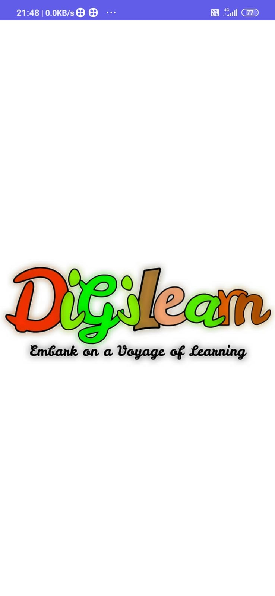 &ensp;&ensp;&ensp;&ensp;&ensp;&ensp;&ensp;&ensp;&ensp;
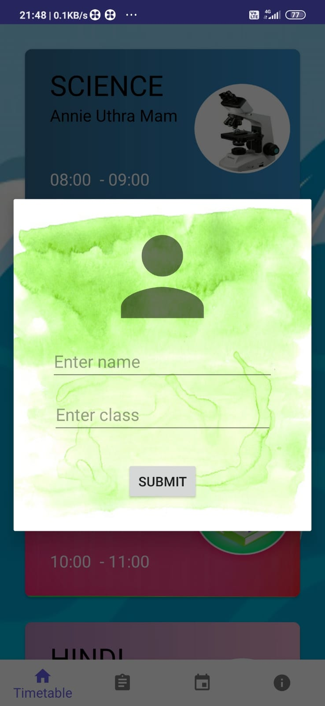 &ensp;&ensp;&ensp;&ensp;&ensp;&ensp;&ensp;&ensp;&ensp; 
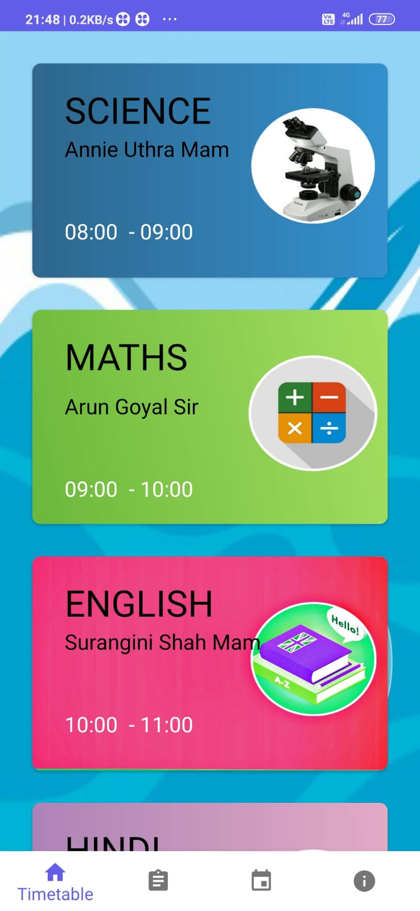 &ensp;&ensp;&ensp;&ensp;&ensp;&ensp;&ensp;&ensp;&ensp;
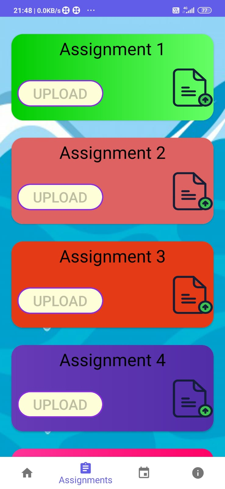 &ensp;&ensp;&ensp;&ensp;&ensp;&ensp;&ensp;&ensp;&ensp;
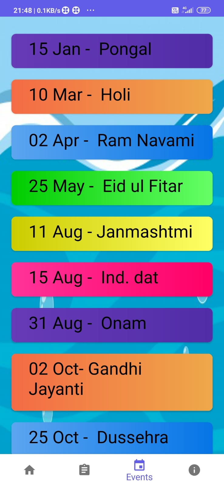 &ensp;&ensp;&ensp;&ensp;&ensp;&ensp;&ensp;&ensp;&ensp;
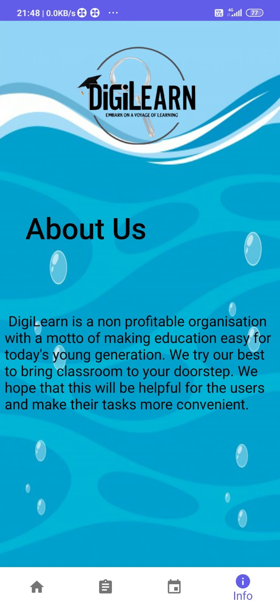 &ensp;&ensp;&ensp;&ensp;&ensp;&ensp;&ensp;&ensp;&ensp;

<h2 align= "left"><b>A Peek at our Website</b></h2>

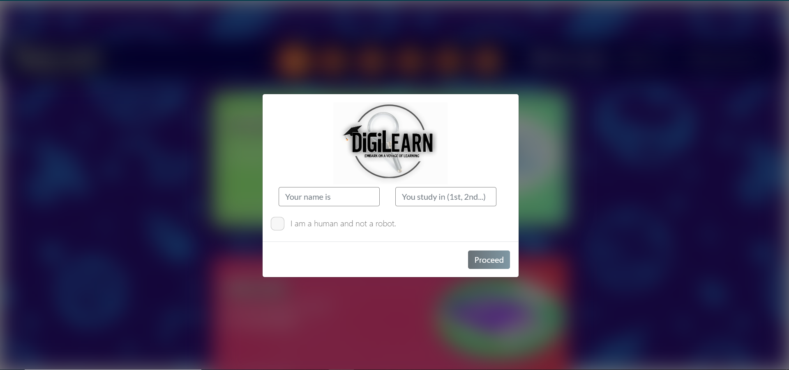 &ensp;
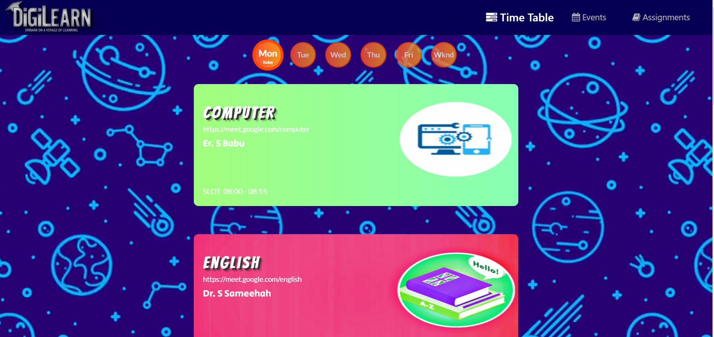 &ensp;
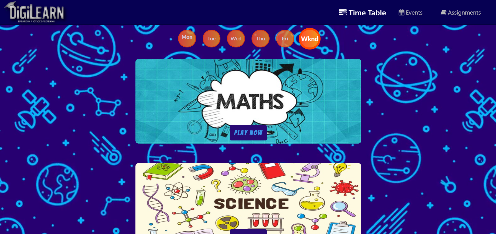 &ensp;
 &ensp;
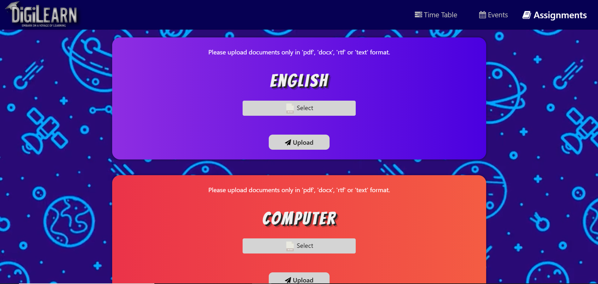 &ensp;
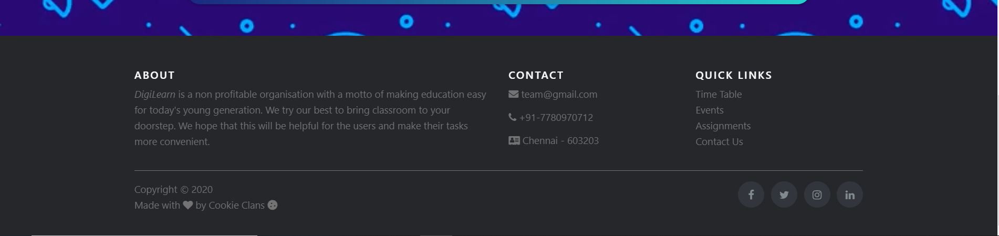 &ensp;

<h2 align= "left"><b>Have Fun With Our Product</b></h2>

- *Website Link* : https://digi-learn.herokuapp.com/

- *App Apk Link* : https://bit.ly/Digi_Learn

- *Youtube Demo Link* : Coming Soon

<h2 align= "left"><b>Tech Stack Used</b></h2>

**WEB**

- eJS,CSS,Bootstrap

- jQuery,notifyJS

- NodeJS,expressJS

- Firebase Storage

**APP**

- Java,Android Studio

- XML attributes

- Firebase Storage and Realtime Database

<h2 align= "left"><b>Project Maintainer(s)</b></h2>

&ensp;&ensp;&ensp;
&ensp;&ensp;&ensp;
&ensp;&ensp;&ensp;
&ensp;&ensp;&ensp;

<a href="https://github.com/Suvoo">
<h4 align="left"><b>Suvodeep Sinha</b></a>&ensp;&ensp;&ensp;&ensp;&ensp;&ensp;&ensp;&ensp;&ensp;&ensp;&ensp;
<a href="https://github.com/mm1025web"><b>Mohammad Muazam</b>&ensp;&ensp;&ensp;&ensp;&ensp;&ensp;&ensp;&ensp;&ensp;&ensp;&ensp;
<a href="https://github.com/mm7104"><b>Mayukh Mishra</b>&ensp;&ensp;&ensp;&ensp;&ensp;&ensp;&ensp;&ensp;&ensp;&ensp;&ensp;
<a href="https://github.com/yashjoshi007"><b>Yash Joshi</b>
  
  </h4></a>
